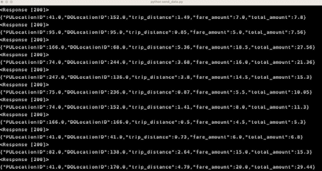
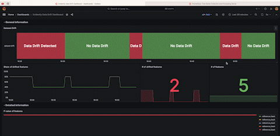

# MLOps Project

## Project Description

In this MLOps project I created a CI/CD workflow with Github Actions and MLflow to train a model, which is deployed as an API and monitored in real time for data drift with evidently, prometheus and grafana. Data drift is reduced by retraining the model in the production environment, without interrupting the service.

## Project Structure

The steps I took to complete the project were:

- Take the model training code from the notebook and refactor it into a python file
- Initialise DVC with a GCP Bucket to track the training data
- Spin up an MLFlow server and update the training script to register the model in MLFlow and track model versions
- Create a Github Action workflow that pulls the training data from DVC and traings the model
- Create a webservice for the model with FastAPI and deploy to a GCP Virtual Machine (VM) 
- Spin up a second VM for monitoring. Deploy evidently to track, prometheus to store and grafana to publish data drift monitoring statistics. Expose the webservice to the monitoring service.
- Use the Github Action to retrain the model with new data when I see data drift 

## Difficulties and Challenges

When the model retrains with new training data, it was difficult to get  evidently to incorporate the new reference data into the live monitor. To get around this, I:
- pushed the new reference data to GCP Cloud Storage, which evidently could access
- built in a new endpoint, which when triggered, pulled the new reference data into the monitor

This worked, but two variables remained "drifted" and I'm not sure why. Reference data and the data I sent to the model were from the same dataset, albeit different samples. Next time I would incorporate a larger training/reference data set or incorporate a more conservative drift test.

## Results
The send_data.py script sends data to the prediction endpoint every second:

The green areas show where I updated to reference data to match the 

